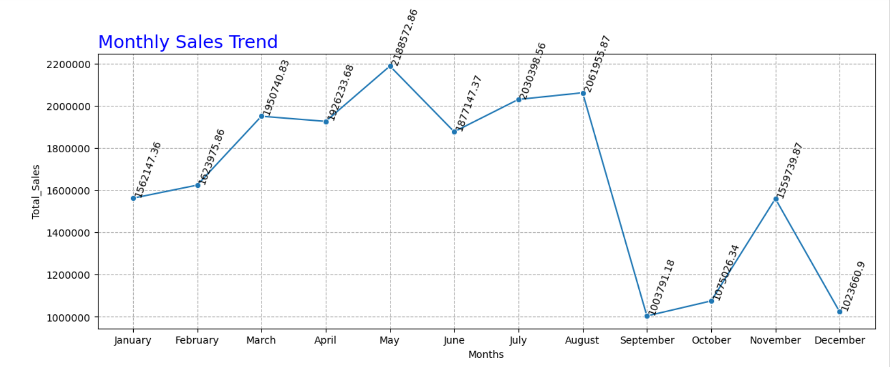
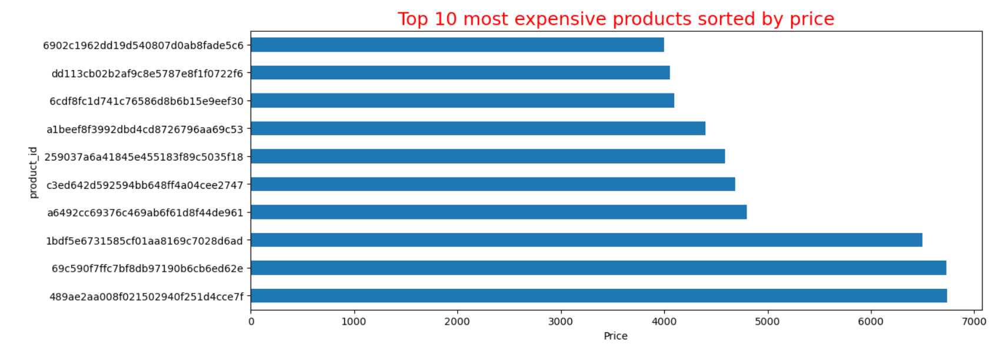
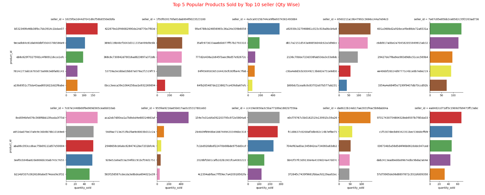
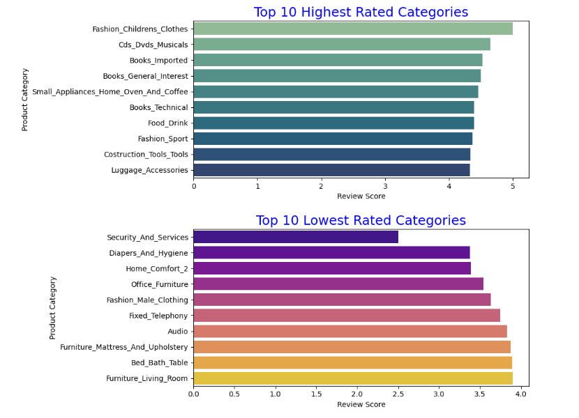

 # 📊 E-Commerce Sales & Customer Analysis using Python

This project performs an end-to-end exploratory data analysis (EDA) on an e-commerce dataset using **Python**, focusing on revenue trends, customer acquisition, retention, and product performance.

It aims to extract business insights using data storytelling, visualizations, and key metrics analysis.

---

## 🚀 Objectives

- Understand overall sales and customer metrics
- Analyze customer acquisition and retention trends
- Identify high-performing products and categories
- Evaluate revenue patterns by time and location
- Extract actionable business insights using Python

---

## 🧰 Tools & Libraries Used

- Python
- Pandas, NumPy
- Matplotlib, Seaborn
- Jupyter Notebook
- SQL (concepts used)
- Excel (optional exports)

---

## 📈 Key Business Metrics Calculated

- ✅ Total Revenue, Total Orders, Total Customers
- ✅ Unique Products, Categories, Sellers
- ✅ Monthly Revenue & Order Trends
- ✅ New vs Returning Customers (Cohort-style)
- ✅ Revenue from New vs Existing Customers
- ✅ Customer Retention & Lifetime Value (CLV)
- ✅ Top Performing Products by Sales & Quantity
- ✅ Preferred Payment Methods & Channels

---

## 🔎 Business Questions Answered

1. **What are the total revenue, number of orders, and customers?**  
2. **How many new customers are acquired each month?**  
3. **What is the retention rate of customers month over month?**  
4. **Which products and categories drive the most revenue?**  
5. **What is the monthly trend of revenue and orders?**  
6. **Which payment methods and channels are most popular?**  
7. **Which states or locations contribute the most sales?**  
8. **How does revenue split between new and existing customers?**

---

## 📂 Folder Structure

```
ecommerce-analysis-python/
│
├── ecommerce_analysis.ipynb       # Jupyter Notebook with complete analysis
├── README.md                      # Project documentation
├── requirements.txt               # (Optional) List of required Python packages
└── data/
    ├── customers.csv # Customer information
    ├── geo_location.csv # Customer/seller location details
    ├── orders.csv # Order-level data
    ├── order_items.csv # Item-level details for each order
    ├── order_payments.csv # Payment method and amounts
    ├── order_review_ratings.csv # Customer ratings & review scores
    ├── products.csv # Product category and info
    └── sellers.csv # Seller locations and IDs
```


## 📊 Sample Visualizations

*Monthly revenue trend over time*
  

*Top 10 selling products by Price*
  

*Top 5 selling products by Each Seller*
  

*Top 10 Maximun & Minimum Rated categories*
  


## 📁 Dataset Source

> *[E-Commerce Public Dataset on Kaggle](https://www.kaggle.com/datasets/singhpriyanshu29/e-commerce-analytics)*
> This dataset contains detailed information about customers, products, sellers, payments, reviews, and orders in an e-commerce business setting.

---

## 💡 Key Insights Summary

- Most revenue comes from a few top-selling products
- Customer retention peaks during festival months
- Online channel dominates sales over offline
- Digital Wallets and Credit Cards are top payment modes
- Repeat customers generate more revenue per order

---

## 🧠 What I Learned

- Applied real-world data cleaning and EDA techniques  
- Built visual stories using Seaborn & Matplotlib  
- Strengthened SQL-based thinking for business metrics  
- Practiced translating data into actionable insights

---

## 🔗 Connect with Me

- 💼 [LinkedIn](https://www.linkedin.com/in/abhishekbhardwaj28)
- 📧 abhishekbhardwaj9617@gmail.com
- 🌐 [Portfolio Website]

---

## 📝 License

This project is under the [MIT License](LICENSE).

---

⭐️ **Star** this repo if you find it helpful!  
📬 Open to feedback and collaboration.


